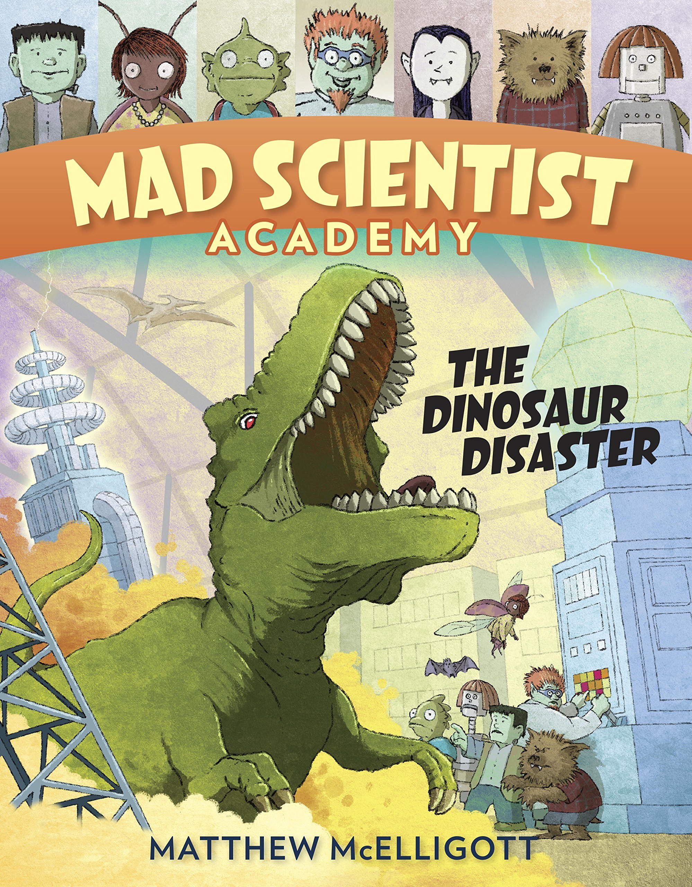

# Sakila-Database-2021
It is a more complete example of database called Sakila for sql server 2019 and higher

# ACADEMY DINOSAUR MOVIE

*This image is just for reference. Copyright their own authors.*

Sakila is an old example database made by the people of MySql (now Oracle Corporation) to test and exercise its database.

## New changes

The database is fine and minimalist however, it only has information of sales from the 2005 to 2006.  So, I extended the values from 2000 to 2021 (not including 2021).

I also added the next features

* The table rental has trends, from year, months and week day, so it is ideal for data analysis (they are not just a bunch of random values).
* The return date of the rentals now makes sense. People return the products in 1 to 5 days.
* most rentals has payments (a few people hadn't pay their rentals), so the payments are not just random values.
* The staff now consists of 55 employees (from 2 initially). However, not all of them are used.
* There are 8 stores (from 1 initially)

# To do

Some features are missing or broken. 

* For example, there is a table language but all movies are in English.

* The amount of payments are not related with the price of the products or the delay of the rentals.
* Some columns are missing or not used anymore
* The naming convention is old school.
* A MySql version and maybe a csv version
* The table inventory needs some cleanups.

# Copyright

BSD License.

Copyright (new version) Jorge Castro Castillo 2021.

[MySQL :: Sakila Sample Database :: 9 License for the Sakila Sample Database](https://dev.mysql.com/doc/sakila/en/sakila-license.html)

