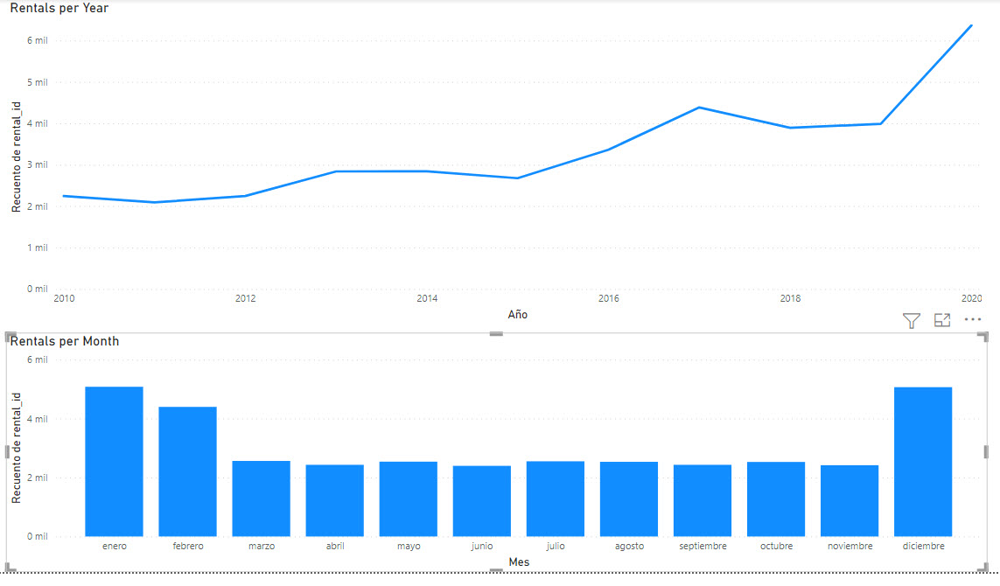

# Sakila Database 2021
It is a more complete example of database called Sakila for sql server 2008-r2 and higher, and Mysql 8.0 and higher.

Also, in the folder csv, you can find the information in csv format (comma separated, double quotes as string delimiter)

## ACADEMY DINOSAUR MOVIE

*This image is just for reference. Copyright their own authors.*

Sakila Database is an old example database made by the people of MySql (now Oracle Corporation) to test and exercise its database. It consists a database of an old video-club that rents movies. It has movies, actors, customers, staff, etc.

## Usage

## SQL SERVER

* Connect to Sql Server (you can use SSMS)
* Create a new database called sakila2021
* Open the sql script [sql_server_sakila2021_schema_data.sql](sql_server_sakila2021_schema_data.sql)
* And runs it.

## MySQL

* Connect to MySQL (you can use Mysql Workbench)
* create a new database called sakila2021
* Open the sql script [mysql_server_sakila2021_schema_data.sql](mysql_server_sakila2021_schema_data.sql)
* And runs it.

> Old version of MySQL. If you want to run in an old version of MYSQL, then you must change the collation utf8mb3 to
> something that fits your version of MySQL.

## New features

The original database is fine and minimalist however, it only has information of sales from the 2005 to 2006 (and not all the months).
So, I extended the values from 2000 to 2021 (not including 2021).

I also added the next features

* The table rental has trends, from year, months and week day, so it is ideal for data analysis (they are not just a bunch of random values).
* The return date of the rentals now makes sense. People return the products in 1 to 5 days.
* most rentals has payments (a few people hadn't paid their rentals), so the payments are not just random values.
* The staff now consists of 55 employees (from 2 initially). However, not all of them are used or sold a thing.
* There are 8 stores (from 1 initially)

## To do

Some features are missing or broken. 

* For example, there is a table language but all movies are in English.
* There is a table called film_text but there is nothing there.
* The amount of payments is not related with the price of the products or the delay of the rentals.
* Some columns are missing or not used anymore
* The naming convention is old school.
* ~~A MySql version and maybe a csv version~~
* The table inventory needs some cleanups.

# Changes

* 1.3 2023-02-11 Now Mysql has foreign keys.
* 1.2 added MySQL and CSV

* 1.1 changed from .bak (only for sql server 2019) to .sql (compatible with sql server 2008 r2 and higher). While it is slow to load, but it is more compatible

# Copyright

BSD License.

Copyright (new version) Jorge Castro Castillo 2021.

[MySQL :: Sakila Sample Database :: 9 License for the Sakila Sample Database](https://dev.mysql.com/doc/sakila/en/sakila-license.html)

